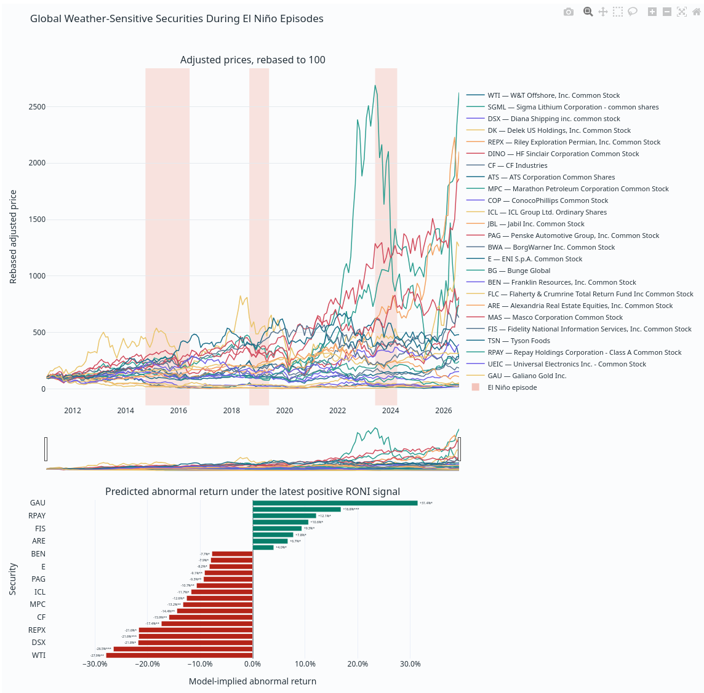

# El Niño Securities Screen

This project tests whether NOAA's Relative Oceanic Niño Index (RONI), observed at month `t`, predicts [market-adjusted security returns](https://en.wikipedia.org/wiki/Abnormal_return) over the following 1, 3, or 6 months. It generates an interactive report containing the strongest validated forecasts and a compressed audit table containing every stock–horizon test.

This is an exploratory [statistical](https://en.wikipedia.org/wiki/Statistics) screen, not a trading model. [Correlation does not establish causation](https://en.wikipedia.org/wiki/Correlation_does_not_imply_causation), and [statistical significance](https://en.wikipedia.org/wiki/Statistical_significance) does not imply that a relationship is economically meaningful or tradable.

## Setup

Python 3.10 or newer is recommended.

```bash
python -m venv .venv
source .venv/bin/activate
pip install -r requirements.txt
```

## Running the screen

Perform the initial universe and price download:

```bash
python src/el_nino_screen.py --data-mode update
```

Later runs can use one of three data modes:

```bash
# Use cached data when available; download only when no cache exists.
python src/el_nino_screen.py

# Prohibit network requests and require an existing cache.
python src/el_nino_screen.py --data-mode local-only

# Refresh the universe and RONI, download full history for new symbols,
# and update recent prices for previously cached symbols.
python src/el_nino_screen.py --data-mode update
```

Additional options:

```bash
# Delete artifacts/cache/ and rebuild it.
python src/el_nino_screen.py --clear-cache --data-mode update

# Show 50 results, require seven years of monthly observations, and use
# download batches of 200 symbols.
python src/el_nino_screen.py \
  --top 50 \
  --min-observations 84 \
  --batch-size 200 \
  --data-mode update
```

Run `python src/el_nino_screen.py --help` for the complete CLI reference.

## Data universe and cache

The script builds its primary universe from the Nasdaq Trader symbol directories for Nasdaq and other US-listed securities. It removes entries identified as ETFs, test issues, preferred shares, warrants, rights, units, or debt. A curated set of international and weather-sensitive securities defined in `el_nino_screen.py` is then added to the universe.

Yahoo Finance does not provide an authoritative list of every global stock, so this is a broad reproducible universe rather than complete worldwide coverage.

The cache is stored under `artifacts/cache/`:

- `universe.csv`: resolved screening universe and metadata
- `monthly_adjusted_prices.csv.gz`: monthly adjusted prices
- `roni.csv`: parsed NOAA RONI observations

Price downloads run in resumable batches and checkpoint every ten batches. `--clear-cache` removes only this directory; generated reports remain intact.

## Outputs

Every successful run creates:

- `artifacts/el_nino_screen.html`: interactive charts for up to `--top` securities, ranked by predictive selection score
- `artifacts/el_nino_screen.csv.gz`: every eligible stock–horizon test, including expected abnormal return, out-of-sample results, episode stability, HAC inference, and BH-FDR significance

The HTML report rebases each displayed adjusted-price series to 100 and shades El Niño episodes where RONI is at least 0.5°C for five consecutive overlapping seasons.

### Example report



This snapshot of `el_nino_screen.html` illustrates the two parts of the report. The upper panel compares the selected securities' adjusted prices after rebasing each series to 100; the shaded bands mark historical El Niño episodes. The lower panel shows the model-implied market-adjusted return for each security under the latest positive RONI signal, using the model-selected 1-, 3-, or 6-month horizon.

In this run, Galiano Gold (`GAU`) has the largest positive estimated abnormal return, at approximately 31%, while W&T Offshore (`WTI`) has the largest negative estimate, at approximately -28%. Several other securities have positive estimates in the roughly 4–17% range, while many of the selected negative sensitivities fall between approximately -8% and -26%. These results describe historical predictive relationships after the screen's validation and multiple-testing controls; they do not establish that El Niño caused the returns or that the estimates will be realized. Because the latest RONI observation, market data, and selected securities can change, this image is an example rather than a permanent forecast.

## What the model calculates

The [unit of analysis](https://en.wikipedia.org/wiki/Unit_of_analysis) is a stock–horizon pair. Every eligible stock is tested separately at 1-, 3-, and 6-month forward horizons. These horizons are fixed before testing so the program does not search an unrestricted set of holding periods.

### 1. Monthly total returns

Yahoo adjusted closing prices are converted to [simple monthly returns](https://en.wikipedia.org/wiki/Rate_of_return):

$$
r_{i,t} = \frac{P_{i,t}^{\mathrm{adj}}}{P_{i,t-1}^{\mathrm{adj}}} - 1
$$

Adjusted prices incorporate splits and distributions. Infinite values and months without usable prices are excluded.

### 2. Forward returns

For a horizon $h$, the program [compounds](https://en.wikipedia.org/wiki/Compound_interest) the next $h$ monthly returns using their [geometric product](https://en.wikipedia.org/wiki/Geometric_mean). The target attached to month $t$ therefore contains returns from $t+1$ through $t+h$:

$$
R_{i,t}^{(h)} = \prod_{j=1}^{h}\left(1 + r_{i,t+j}\right) - 1
$$

This ordering is important. RONI at $t$ is used to predict returns occurring afterward; future RONI is not moved backward and presented to the model as information that was already known.

### 3. Broad-market adjustment

For each month, the [median](https://en.wikipedia.org/wiki/Median) return across the available screening universe is used as a [robust](https://en.wikipedia.org/wiki/Robust_statistics) market [proxy](https://en.wikipedia.org/wiki/Proxy_%28statistics%29). Its future returns are compounded over the same horizon. The regression target is:

$$
AR_{i,t}^{(h)} = R_{i,t}^{(h)} - R_{m,t}^{(h)}
$$

This asks whether the stock tended to outperform or underperform the broad universe after a given RONI observation. It avoids selecting a stock merely because the entire market rose or fell during historical El Niño periods. The median is used instead of the mean so a handful of extreme or erroneous security returns have less influence on the benchmark.

### 4. Predictive regression

For every stock and horizon with enough matched data, the program estimates an [ordinary least squares regression](https://en.wikipedia.org/wiki/Ordinary_least_squares):

$$
AR_{i,t}^{(h)} = \alpha_{i,h} + \beta_{i,h}\,\mathrm{RONI}_t + \varepsilon_{i,t,h}
$$

The default requirement is 60 matched months. It can be changed with `--min-observations`, but the program rejects values below 24.

The fitted [`slope`](https://en.wikipedia.org/wiki/Slope) is the estimated change in future abnormal return associated with a one-degree increase in RONI. A positive slope indicates historical outperformance after stronger warm ENSO readings; a negative slope indicates historical underperformance.

The displayed expected abnormal return is the incremental RONI effect relative to a neutral RONI of zero:

$$
\widehat{AR}_{i,h}^{\mathrm{expected}}
= \beta_{i,h}\max\!\left(\mathrm{RONI}_{\mathrm{latest}}, 0\right)
$$

The regression [intercept](https://en.wikipedia.org/wiki/Y-intercept) is deliberately excluded from this number because it represents the stock's average abnormal return unrelated to the current positive RONI signal. When the latest RONI is zero or negative, the estimated positive-El-Niño effect is zero.

### 5. Inference with overlapping returns

Forward 3- and 6-month targets overlap. Their [residuals](https://en.wikipedia.org/wiki/Errors_and_residuals) are therefore [serially dependent](https://en.wikipedia.org/wiki/Autocorrelation), and ordinary regression [standard errors](https://en.wikipedia.org/wiki/Standard_error) would generally be too optimistic. The program uses [Newey–West heteroskedasticity-and-autocorrelation-consistent covariance estimates](https://en.wikipedia.org/wiki/Newey%E2%80%93West_estimator). [Heteroskedasticity](https://en.wikipedia.org/wiki/Heteroskedasticity) means that error variance can change across observations.

The lag count is:

$$
L = \max\!\left(\left\lfloor 4\left(\frac{n}{100}\right)^{2/9}\right\rfloor,\ h-1,\ 1\right)
$$

This combines an automatic sample-size bandwidth with enough [lags](https://en.wikipedia.org/wiki/Lag_operator) to cover dependence mechanically created by overlapping forward-return windows. The resulting slope standard error produces a [t-statistic](https://en.wikipedia.org/wiki/T-statistic) and [two-sided p-value](https://en.wikipedia.org/wiki/P-value).

### 6. Purged walk-forward validation

An in-sample relationship can look impressive even when it has no forecasting value. The program therefore applies the time-ordered logic of [cross-validation](https://en.wikipedia.org/wiki/Cross-validation_%28statistics%29), using [walk-forward validation](https://en.wikipedia.org/wiki/Backtesting) to simulate how the model would have behaved through time:

1. Fit using only observations whose complete future-return targets would have been known at that date.
2. Predict the next eligible observation.
3. Expand the training window by one observation.
4. Repeat through the remaining history.

For an $h$-month target, the most recent $h-1$ potentially overlapping training labels are excluded. This purge prevents a training target containing future prices from leaking into an earlier prediction.

The principal validation metric is [out-of-sample R²](https://en.wikipedia.org/wiki/Coefficient_of_determination):

$$
R_{\mathrm{OOS}}^2
= 1 - \frac{\sum_t\left(y_t-\widehat{y}_t\right)^2}
{\sum_t\left(y_t-\bar{y}_{t-1}\right)^2}
$$

- $R_{\mathrm{OOS}}^2 > 0$ means the RONI regression beat a forecast based only on the historical mean.
- $R_{\mathrm{OOS}}^2 = 0$ means equal squared-error performance.
- $R_{\mathrm{OOS}}^2 < 0$ means the simpler historical-mean forecast performed better.

The audit table also reports [directional accuracy](https://en.wikipedia.org/wiki/Forecast_skill): the fraction of walk-forward predictions whose [sign](https://en.wikipedia.org/wiki/Sign_function) matched the sign of the realized abnormal return. It is a diagnostic, not a standalone qualification rule.

### 7. Consistency across El Niño episodes

Months with $\mathrm{RONI} \ge 0.5$ are divided into distinct contiguous warm intervals. The program calculates the stock's mean future abnormal return within each interval and compares its sign with the full-sample regression slope.

$$
\mathrm{event\ sign\ consistency}
= \frac{\text{warm intervals with matching signs}}
{\text{observed warm intervals}}
$$

A stock passes temporal validation only when all three conditions hold:

- out-of-sample R² is positive;
- at least three distinct warm intervals are represented; and
- at least two-thirds of those intervals have the same effect direction as the fitted slope.

This is a form of [stability analysis](https://en.wikipedia.org/wiki/Sensitivity_analysis) that prevents one unusually favorable historical El Niño from being treated as a repeatedly observed relationship.

### 8. Correction for thousands of tests

Testing thousands of securities at three horizons creates a [multiple-comparisons problem](https://en.wikipedia.org/wiki/Multiple_comparisons_problem) and will produce small raw p-values by chance. The [Benjamini–Hochberg procedure](https://en.wikipedia.org/wiki/Benjamini%E2%80%93Hochberg_procedure) is applied jointly to every eligible stock–horizon p-value. The resulting [`q_value`](https://en.wikipedia.org/wiki/Q-value_%28statistics%29) controls the expected [false-discovery proportion](https://en.wikipedia.org/wiki/False_discovery_rate) across the complete [family of tests](https://en.wikipedia.org/wiki/Family-wise_error_rate).

A test is marked statistically significant only when:

$$
q < 0.05
$$

The correction is applied before selecting the displayed stocks, not merely to the final top 25.

### 9. Selection score and ranking

The model calculates a selection score for each stock–horizon pair. It combines an [effect size](https://en.wikipedia.org/wiki/Effect_size) relative to [residual volatility](https://en.wikipedia.org/wiki/Standard_deviation), predictive fit, and event stability:

$$
\mathrm{effect\text{-}to\text{-}risk}_{i,h}
= \frac{\left|\widehat{AR}_{i,h}^{\mathrm{expected}}\right|}
{\sigma_{\varepsilon,i,h}}
$$

$$
\mathrm{selection\ score}_{i,h}
= \mathrm{effect\text{-}to\text{-}risk}_{i,h}
\sqrt{\max\!\left(R_{\mathrm{OOS},i,h}^2, 0\right)}
\times \mathrm{event\ sign\ consistency}_{i,h}
$$

Consequently, a large fitted return receives little or no ranking credit when it is noisy, fails out of sample, or has an inconsistent sign across warm intervals.

One horizon is retained per stock. The program first prefers horizons that pass temporal validation, then higher selection scores, and finally lower q-values as a tie-breaker. Stocks are displayed in this order:

1. pass temporal validation;
2. pass the $q < 0.05$ significance threshold;
3. have a higher selection score; and
4. have a larger absolute expected abnormal return.

Dark teal and red bars pass both validation and corrected significance. Gray bars do not satisfy both requirements and should be treated as exploratory.

## Why this can help identify El Niño-sensitive stocks

Simple contemporaneous correlation answers whether a stock and RONI moved together during the same month. It does not answer whether information available now preceded a later price change. This screen is more relevant to an approaching or developing El Niño because it measures returns after the RONI observation and requires the relationship to work in simulated historical forecasts.

The individual safeguards answer different failure modes:

- Market adjustment separates stock-specific relative movement from broad [systematic risk](https://en.wikipedia.org/wiki/Systematic_risk).
- Multiple forward horizons allow fast and slower transmission channels without selecting from an unlimited number of periods.
- Purged walk-forward testing rejects relationships that exist only when future data are visible during fitting.
- Episode consistency favors repeatable effects over results dominated by one event.
- HAC inference accounts for volatility changes and overlapping returns.
- Universe-wide false-discovery correction limits [false positives](https://en.wikipedia.org/wiki/False_positives_and_false_negatives) arising from testing thousands of candidates.
- Effect-to-risk ranking favors economically larger and less noisy responses after statistical eligibility is considered.

Together, these metrics identify stocks whose historical prices exhibited a repeatable, forward-looking sensitivity to observed warm ENSO conditions. They provide a defensible research shortlist for examining company operations, geographic exposure, commodity inputs, hedging, and valuation.

## Important limitations

The output is not proof that El Niño caused a price change, nor is `expected_abnormal_return` a guaranteed forecast. RONI may proxy for [confounding variables](https://en.wikipedia.org/wiki/Confounding), and the regression does not currently control for sector, country, currency, commodity prices, interest rates, company announcements, [nonlinear responses](https://en.wikipedia.org/wiki/Nonlinear_regression), [transaction costs](https://en.wikipedia.org/wiki/Transaction_cost), or [survivorship bias](https://en.wikipedia.org/wiki/Survivorship_bias).

The model uses historical observed RONI because a stable machine-readable archive of official real-time NOAA/IRI forecast [vintages](https://en.wikipedia.org/wiki/Real-time_data) is not available to the script. It is most applicable once a warm event is developing and appears in RONI. It is not an early-warning [backtest](https://en.wikipedia.org/wiki/Backtesting) of changes in NOAA's published El Niño [probabilities](https://en.wikipedia.org/wiki/Probability) before RONI itself rises.

The report should therefore be used as a screening tool, followed by company-specific research and independent risk analysis. A stock can pass every statistical filter and still move for unrelated reasons or fail to repeat its historical behavior.

## Project files

```text
.
├── artifacts/
│   ├── cache/
│   ├── el_nino_screen.html
│   └── el_nino_screen.csv.gz
├── src/
│   ├── el_nino_screen.py
│   ├── predictive_screen.py
│   └── universe_cache.py
├── read_me_resources/
│   └── demo.png
├── README.md
└── requirements.txt
```

Data sources:

- Security universe: [Nasdaq Trader symbol directory](https://www.nasdaqtrader.com/Trader.aspx?id=SymbolDirDefs)
- Security prices: Yahoo Finance through `yfinance`
- ENSO index: [NOAA CPC RONI](https://www.cpc.ncep.noaa.gov/products/analysis_monitoring/enso/roni/)
